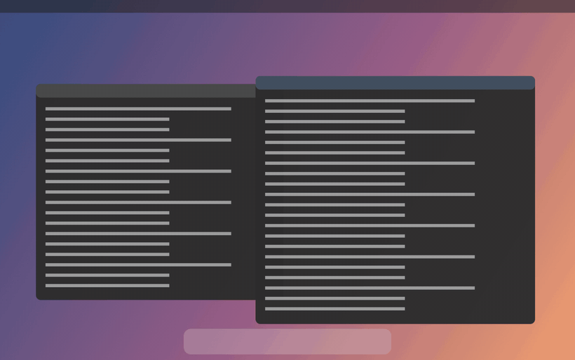

# Softclose

**Your desktop folds away as you close the lid.**

Softclose reads the hinge angle from the sensor in your MacBook, captures the
live desktop, and renders it as a sheet folding away from you — tilting,
blurring and falling into shadow as the lid comes down, settling back flat as it
opens.



*Rendered against a mock desktop, driven by the same angle curve and spring the
app uses.*

[](https://buymeacoffee.com/matej2510)


> Inspired by [Bendy](https://trybendy.app), a paid app that does this
> beautifully. This is an independent implementation written from scratch — if
> you like the idea, go and buy theirs too.

## Requirements

- macOS 14 Sonoma or later
- An Apple silicon MacBook with a lid angle sensor
- Screen Recording permission, so the desktop can be captured

## Install

```bash
./install.sh          # build, install to /Applications, re-arm permission, launch
./build.sh            # just the bundle, into build/Softclose.app
```

The build compiles the Swift package, compiles `Bend.metal` into a metallib,
assembles the bundle and ad-hoc signs it.

### Ad-hoc signing and permissions

Screen Recording permission is remembered per signature. Because `build.sh`
signs ad-hoc, **every rebuild looks like a different app to macOS**. The failure
is a quiet one: the switch in Privacy settings still reads as on, but capture
fails with *"the user declined TCCs"*, because the grant no longer matches the
binary.

`install.sh` handles it by running
`tccutil reset ScreenCapture io.github.matejcok1234.softclose` after each build,
so the next launch asks cleanly rather than failing against a stale approval. If
you would rather grant it once and never again, sign with a stable self-signed
identity instead of ad-hoc.

## Using it

Softclose lives in the menu bar; there is no Dock icon and no window unless you
open Settings.

- **Style** — Silk (mostly fold), Shade (falls into shadow), Frost (softens to
  frosted glass). Each is a weighting of the same three sliders, so touching a
  slider drops you into Custom.
- **Clears at** — above this hinge angle the desktop is left alone and capture
  stops. On first launch Softclose takes the angle your lid is sitting at and
  clears just below it, so there is no permanent fold on a laptop held at 90°.
- **Drag the angle myself** — ignores the sensor and holds the fold wherever you
  put the slider. The easiest way to choose a look, and the only way to see the
  effect on a Mac without the sensor.
- **⌥⌘B** — pause and resume from anywhere. Uses Carbon's hot key API, which
  needs no Accessibility permission.

Under **Advanced** are the constants the three style sliders scale — the fold
depth in degrees, the widest blur radius (in points, so it looks the same on any
display), the lens distance, and the stiffness of the spring that follows the
hinge. The settings window floats above the
overlay on purpose, so all of it can be tuned against a live fold.

Settings live in `defaults`, so a look can be inspected or scripted:

```bash
defaults read io.github.matejcok1234.softclose
defaults write io.github.matejcok1234.softclose manualAngle -float 45
defaults delete io.github.matejcok1234.softclose manualAngle
```

## How it works

| | |
|---|---|
| `LidAngleSensor` | The hinge is an Apple HID device (`las`) on the sensor usage page, usage `0x8A`, answering feature report 1 as `[0x01, low, high]` — whole degrees, little-endian. Polled, for the reason below. |
| `ScreenCapture` | ScreenCaptureKit, filtered to exclude Softclose's own windows — the overlay is showing the capture, so including it would feed the picture back into itself. Frames arrive as `IOSurface`-backed Metal textures; nothing is copied to the CPU. |
| `AppStatus` | Live runtime state, kept apart from persisted settings so the readout can move without the settings view being rebuilt under a slider mid-drag. |
| `BendRenderer` | Eases toward the reported angle with a critically damped spring: the sensor jumps in whole degrees, the spring makes it fluid. That easing is the "settles". |
| `Bend.metal` | The desktop is a sheet hinged along its bottom edge. Each row is rotated a little further than the one below it, so it curves into a circular arc rather than tipping as a rigid plane — that curve is what reads as a fold. Shading falls off along it, with ambient occlusion at the hinge. |

### The sensor pushes, but you should poll it anyway

The device registers an input-report callback, which looks like the tidier
design — no polling, no wasted wakeups. Measured over 20 seconds of moving the
lid, it is not:

| path | new values, 20 s of motion | interval |
|---|---|---|
| pushed input reports | 13 | fixed **1 Hz** heartbeat, doesn't change when the lid moves |
| polled feature report | 104 | median **101.8 ms** |

The hardware latches a new angle about ten times a second and simply doesn't
tell you. Polling gets ten times the data, which is most of the difference
between a fold that steps and one that flows. Report IDs 2 and 3 were checked
for finer precision — both are static config (`02 27`, `03 39 8f 94 00 00`,
unchanged across 5,163 reads), so whole degrees is all there is.

Polling costs about 0.5 ms of blocking IPC per read, so it runs on its own
queue rather than the main thread — where it would eat a real slice of a 120 Hz
frame budget — at 30 Hz near the fold and 10 Hz (≈0.6% of one core) while the
lid is just open. Faster than 30 Hz samples the same value twice.

### Smoothness

Whole degrees arriving at 10 Hz, drawn at 120 fps, means twelve frames per new
number. Three things bridge that gap, worth about 3× less frame-to-frame jerk in
simulation than the naive version:

1. **Extrapolation** — the angle is carried forward at the speed the lid was
   last moving, capped at 90 ms of lead. Past that it stops being a good guess
   and starts being a wobble, particularly where the lid changes direction.
2. **A per-frame target** — the renderer pulls a fresh angle at the top of every
   frame rather than waiting to be told one landed, so the fold can advance on
   every refresh.
3. **A substepped spring** — integrated in fixed 1/240 s steps, so a dropped
   frame arrives late rather than as a kick. Damping is a ratio of critical,
   defaulting to 0.9: it drifts fractionally past the target and comes back,
   which is what reads as settling rather than stopping.

Capture is also brought up 12° before the clear angle, so the stream is warm by
the time the fold is visible instead of appearing a beat late and part-way down.

### Two things worth knowing about the shaders

The blur runs at half resolution with nine taps either side, which puts the taps
`sigma/3` apart — more than a texel once the blur widens, and sampling detail
finer than the gap turns it into stripes. Each tap reads from the mip level
where its own spacing is one texel, so it averages the pixels it steps over.

The cross-fade to the blurred copy saturates early rather than tracking blur
strength. A lasting half-and-half mix keeps sharp edges visible *through* the
blur, which reads as a double image rather than as frost.

## Privacy

Frames are captured, rendered and discarded on device. Nothing is recorded,
saved or uploaded, and Softclose makes no network connections of any kind.

The overlay is deliberately left visible to other recorders, so the fold can be
screen-recorded — excluding it would make it invisible to QuickTime and ⌘⇧5.

## Layout

```
Sources/Softclose/
  main.swift            NSApplication, accessory activation policy
  AppDelegate.swift     Menu bar, hot key, permission state
  BendController.swift  Ties the hinge to the screen; starts and stops everything
  LidAngleSensor.swift  HID
  ScreenCapture.swift   ScreenCaptureKit
  BendRenderer.swift    Metal render loop and the easing spring
  OverlayWindow.swift   Borderless, click-through, above everything
  SettingsView.swift    SwiftUI settings
  Settings.swift        Persistence, style presets, the angle→progress curve
  AppStatus.swift       Live runtime state for the UI
  Click.swift           The click when the desktop clears, synthesised
  Shaders/Bend.metal    Fold, blur, shading
Tools/
  MakeIcon.swift        Draws the icon at every size iconutil wants
  RenderPreview.swift   Renders the fold against a mock desktop, for judging it
                        without permissions or a moving lid
probe/
  lidprobe.swift        Dumps the raw lid angle sensor reports
  inputprobe.swift      Confirms the sensor pushes input reports
  ratetest.swift        Push rate vs poll rate, and what the other report
                        IDs actually contain — the measurement above
```

`Tools/RenderPreview.swift` is the fastest way to iterate on the look — it needs
no permissions and no moving lid:

```bash
swiftc -O Tools/RenderPreview.swift -o build/renderpreview
./build/renderpreview build/preview      # → PNGs at a range of hinge angles
```

## Support

If this made your laptop nicer to close, you can
[buy me a coffee](https://buymeacoffee.com/matej2510). ☕

## Licence

MIT — see [LICENSE](LICENSE).
